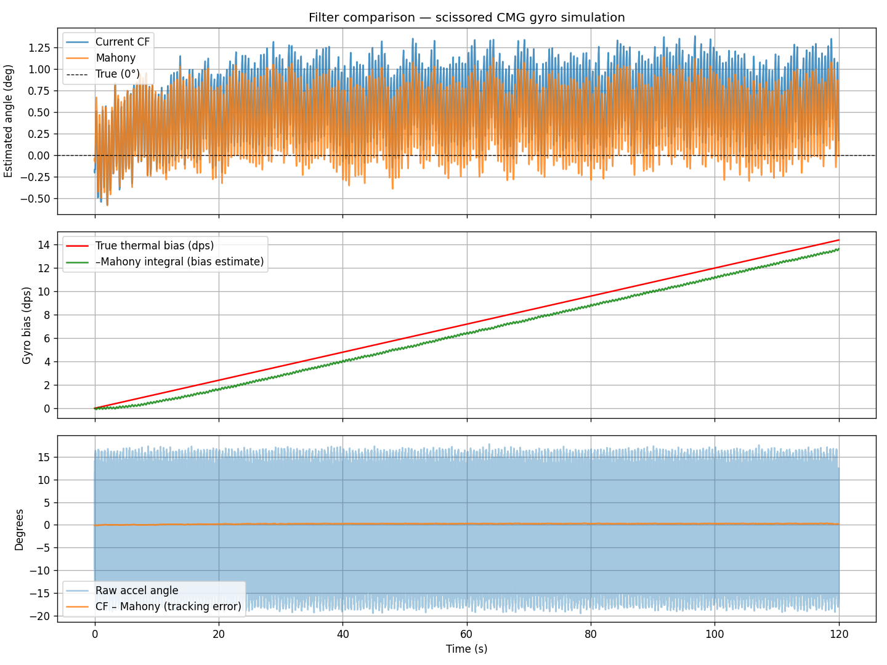

# Wheelo: Scissored CMG Balancing Robot

Wheelo is an open-source, single-axis balancing robot that uses a **Scissored Control Moment Gyroscope (CMG)** system for stabilization. Unlike traditional balancing robots that use wheel acceleration, Wheelo stays upright by harnessing gyroscopic precession torque.

## 🚀 Key Features
- **Scissored CMG Design:** Two counter-rotating flywheels geared together to provide pure torque and cancel parasitic yaw/roll.
- **XIAO ESP32-C3 Core:** Compact, powerful microcontroller with WiFi/OTA capabilities.
- **High-Speed Actuation:** ST3215 1Mbps Serial Bus Servo for precise gimbal control.
- **Advanced Filtering:** Mahony filter with Median and Low-Pass stages for stable orientation sensing.
- **Web Dashboard:** Real-time PID tuning, telemetry, and calibration via a built-in web server.

## 📂 Repository Structure
- **/firmware**: ESP32-C3 source code (PlatformIO project).
- **/hardware**: 3D assembly files (.3mf) and CAD links.
- **/tools**: Python scripts for telemetry logging and filter simulation.
- **/docs**: Technical documentation and performance charts.

## 🛠 Hardware
### CAD
The mechanical design is available on Onshape:
**[Insert Onshape Link Here]**

### Components
- **MCU:** Seeed Studio XIAO ESP32-C3
- **IMU:** MPU6050 / MPU6500
- **Gimbal Servo:** Waveshare ST3215 (Serial Bus Servo)
- **Flywheel Motor:** BLDC Motor + ESC (2S-3S LiPo compatible)

## 💻 Firmware Setup
1. Install [PlatformIO](https://platformio.org/).
2. Open the `firmware/main` directory.
3. Configuration is in `firmware/main/src/config.h` (WiFi, Pins, etc.).
4. Flash via USB: `pio run -t upload`.

## 📈 Tools
- `tools/sim_filter.py`: A Python simulation to test and validate the Mahony filter against recorded IMU data.
- `tools/telemetry.py`: Real-time WiFi telemetry logger for performance analysis.

## 📜 License
This project is open-source under the MIT License. Feel free to build, modify, and share!
